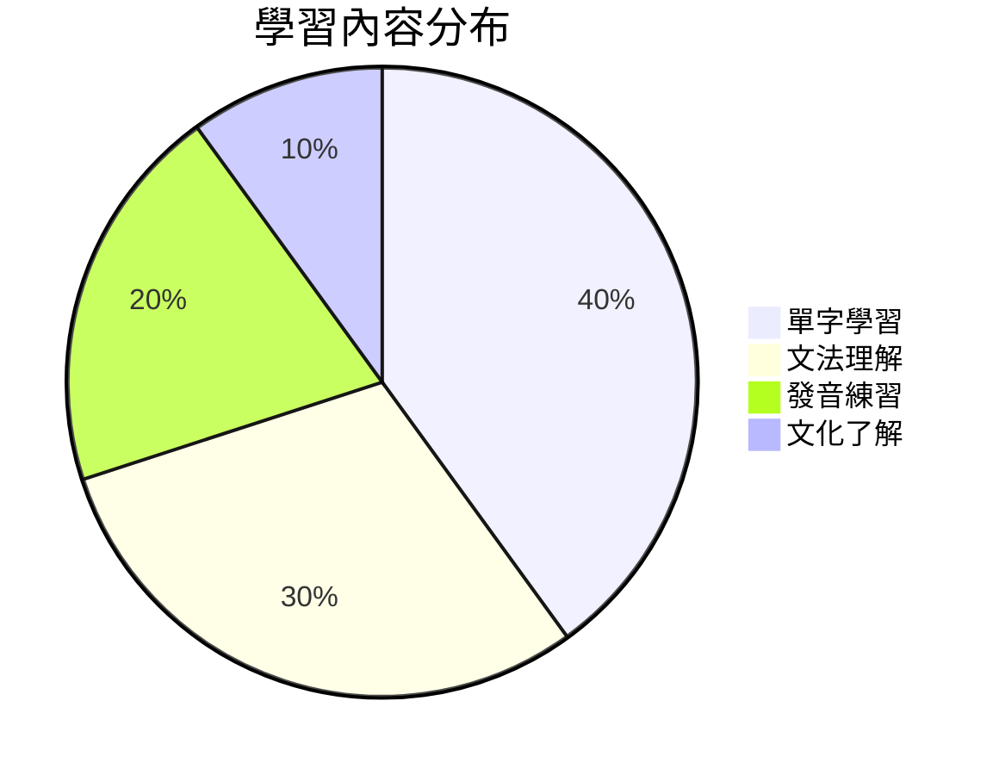

# 幕後花絮：《Lemon》學習資源創作過程

> 記錄創作過程中的思考、挑戰和學習。

## 🎯 創作背景

### 為什麼選擇《Lemon》？
1. **歌曲代表性**：米津玄師的代表作，日本流行音樂的經典
2. **學習價值**：發音清晰、文法多樣、情感豐富
3. **文化意義**：反映現代日本社會的情感表達
4. **教學潛力**：適合從初學到進階的多層次學習

### 目標讀者
- **日文初學者**：透過歌曲建立學習興趣
- **中級學習者**：深化文法理解和發音技巧
- **文化愛好者**：了解日本現代音樂文化
- **自學者**：需要結構化的學習資源

## 🛠️ 技術實現

### 內容架構設計
```
挑戰：如何組織大量學習內容？
解決方案：樹狀結構 + 漸進式學習路徑

1. 系列目錄 → 提供整體學習地圖
2. 逐句解析 → 專注細節學習
3. 資源整合 → 方便複習和參考
```

### 互動功能實現
```
挑戰：靜態網站如何提供互動感？
解決方案：使用多種技術組合

- Mermaid圖表：視覺化學習概念
- 練習題模板：提供自我檢測
- 資源連結：連接外部學習工具
- 響應式設計：確保各種裝置體驗
```

### 技術工具選擇
- **astro-modular**：專為內容創作設計的靜態網站框架
- **Obsidian風格wikilinks**：增強內容連結性
- **GitHub工作流**：確保版本控制和協作
- **Cloudflare部署**：快速穩定的發布平台

## 🧩 創作挑戰與解決

### 挑戰1：內容深度與廣度的平衡
**問題**：既要詳細解析，又要保持可讀性
**解決**：
- 分層次呈現：基礎→進階→延伸
- 視覺化輔助：圖表、表格、範例
- 互動元素：練習題、自我檢測

### 挑戰2：技術限制與創意實現
**問題**：靜態網站的互動功能限制
**解決**：
- 利用現有技術：Mermaid、Markdown擴展
- 設計替代方案：模板化練習題
- 外部資源整合：連結到專業工具

### 挑戰3：多裝置相容性
**問題**：確保各種裝置的良好體驗
**解決**：
- 響應式設計測試
- 圖片和資源優化
- 閱讀體驗優先設計

## 📚 內容創作原則

### 教學設計原則
1. **漸進式學習**：從簡單到複雜
2. **多感官學習**：視覺、聽覺、實踐結合
3. **情境化學習**：在真實情境中學習語言
4. **自主學習**：提供自我檢測和調整工具

### 內容品質原則
1. **準確性優先**：確保語言和文化資訊正確
2. **實用性導向**：專注實際可用的語言技能
3. **清晰性要求**：表達清晰，結構明確
4. **一致性保持**：風格和格式統一

### 使用者體驗原則
1. **易讀性**：排版清晰，閱讀舒適
2. **可訪問性**：考慮各種使用情境
3. **導航性**：結構清晰，易於查找
4. **互動性**：提供參與和實踐機會

## 🔍 技術細節

### Wikilinks使用
```markdown
# 內部連結
[[檔案名稱]]              # 基本連結
[[檔案名稱#標題]]         # 錨點連結
[[檔案名稱|顯示文字]]     # 自定義文字

# 媒體嵌入
![[圖片.png]]            # 圖片嵌入
![[影片.mp4]]            # 影片嵌入
```

### Mermaid圖表集成
````markdown

````

### 響應式設計要點
1. **流動布局**：適應各種螢幕尺寸
2. **圖片優化**：適當壓縮和格式選擇
3. **字體調整**：確保閱讀舒適度
4. **互動適應**：觸控和滑鼠操作兼顧

## 🎨 設計思考

### 視覺設計
- **色彩選擇**：柔和色調，減少視覺疲勞
- **排版節奏**：適當的留白和分段
- **視覺層次**：清晰的標題和內容區分
- **圖文配合**：圖片輔助理解，不喧賓奪主

### 內容節奏
- **學習節奏**：適當的學習單元劃分
- **難度曲線**：平穩的難度提升
- **複習節點**：定期的複習和總結
- **成就激勵**：學習進度的可視化

### 情感設計
- **學習動機**：保持學習興趣和動力
- **成就感**：提供可見的學習進步
- **社群感**：連接其他學習者
- **文化連結**：透過文化理解增強學習

## 📈 效果評估

### 預期效果
1. **學習效率**：結構化學習路徑提高效率
2. **學習動機**：有趣內容保持學習興趣
3. **技能掌握**：實際語言技能提升
4. **文化理解**：對日本文化更深理解

### 評估指標
- **內容完整性**：是否涵蓋重要學習點
- **教學有效性**：是否容易理解和學習
- **技術穩定性**：網站功能和性能
- **使用者滿意度**：讀者反饋和參與

### 改進機制
1. **讀者反饋**：收集和回應讀者意見
2. **數據分析**：分析訪問和使用數據
3. **定期更新**：根據需求更新內容
4. **技術優化**：持續改進技術實現

## 🤝 協作與分享

### 創作團隊
- **內容創作**：小波（日文學習內容）
- **技術實現**：astro-modular框架
- **設計建議**：參考現有最佳實踐
- **品質保證**：讀者反饋和測試

### 知識分享
- **技術經驗**：記錄技術實現經驗
- **教學方法**：分享語言教學方法
- **設計原則**：總結內容設計原則
- **協作流程**：優化創作協作流程

### 開放資源
- **內容開放**：遵循開放分享原則
- **技術開放**：使用開源技術和工具
- **經驗開放**：分享創作和學習經驗
- **改進開放**：歡迎貢獻和改進建議

## 🔮 未來展望

### 內容擴展
1. **更多歌曲**：擴展到其他日文歌曲
2. **更多主題**：增加文化、生活等主題
3. **更多形式**：影片、音頻等多媒體內容
4. **更多層次**：從初學到精通的完整體系

### 技術升級
1. **互動增強**：更多互動學習功能
2. **個性化**：適應不同學習者的需求
3. **社群功能**：學習者互動和交流
4. **移動體驗**：優化行動裝置體驗

### 社群建設
1. **學習社群**：建立日文學習者社群
2. **內容共創**：讀者參與內容創作
3. **經驗分享**：學習經驗和方法分享
4. **互助學習**：學習者之間的互助

---

## 📝 創作記錄

### 時間線
- **2026年3月21日**：開始《Lemon》學習資源創作
- **同日**：完成系列目錄和單字文法總複習
- **同日**：建立幕後花絮記錄

### 版本記錄
- **v1.0**：初始版本，包含基本學習資源
- **未來更新**：根據讀者反饋持續改進

### 貢獻記錄
- **小波**：主要內容創作和技術實現
- **astro-modular社群**：技術框架支持
- **讀者反饋**：內容改進建議

---

*本文件記錄《Lemon》日文學習資源的創作過程，供內部參考和經驗總結。*  
*更新日期：2026年3月21日*